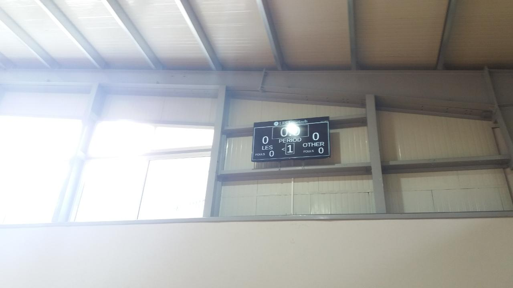
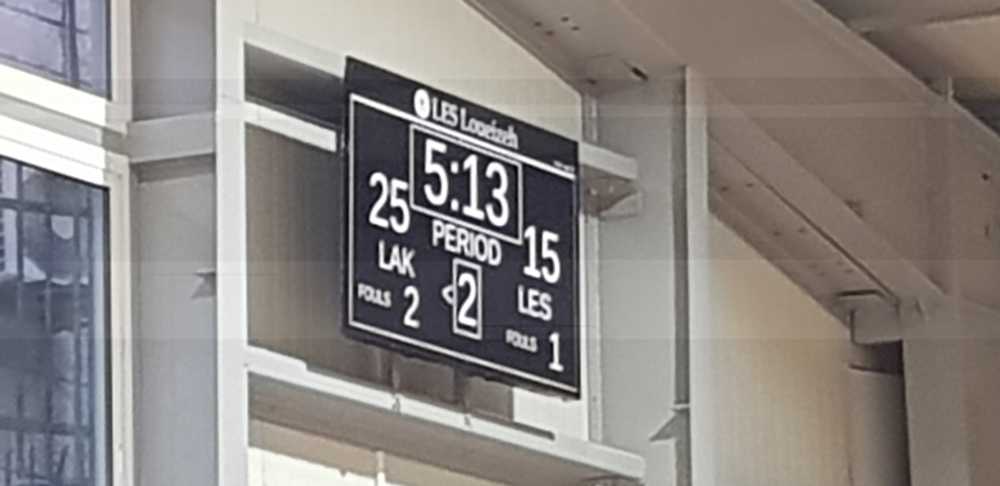

# Scoreboard
This program is a basketball scoreboard that includes a shot clock. This is used at my school, [LES Loueizeh](lesbg.com), with a Raspberry Pi over VNC.

This program can also recover data if a power outage occurs during a game.

This program should work for all OSes, though not yet tested on OSX.

# Pictures

# Requirements:
* Python 3
* Pygame
* Preferably a large display

# Execution:
`cd` into the directory, and run `python3 scoreboard.py`.

Fonts and colors can be controlled by editing `config.txt`.

# Keys:
<kbd> a </kbd>: Add 60s &nbsp;&nbsp;&nbsp;&nbsp;&nbsp; <kbd> z </kbd>: Subtract 60s

<kbd> s </kbd>: Add 1s &nbsp;&nbsp;&nbsp;&nbsp;&nbsp; <kbd> x </kbd>: Subtract 1s

<kbd> d </kbd>: Add 0.1s &nbsp;&nbsp;&nbsp;&nbsp;&nbsp; <kbd> c </kbd>: Subtract 0.1s

<kbd> Space </kbd>: Start/stop clock

<kbd> 1 </kbd>: Set shot clock to 24s and start

<kbd> 2 </kbd>: Set shot clock to 14s and start

<kbd> 0 </kbd>: Start/stop shot clock

<kbd> f </kbd>: Add 1 to period &nbsp;&nbsp;&nbsp;&nbsp;&nbsp; <kbd> v </kbd>: Subtract 1 from period

<kbd> g </kbd>: Change possession

<kbd> h </kbd>: +1 Team 1 &nbsp;&nbsp;&nbsp;&nbsp;&nbsp; <kbd> b </kbd>: +1 Team 2

<kbd> j </kbd>: +2 Team 1 &nbsp;&nbsp;&nbsp;&nbsp;&nbsp; <kbd> n </kbd>: +2 Team 2

<kbd> k </kbd>: +3 Team 1 &nbsp;&nbsp;&nbsp;&nbsp;&nbsp; <kbd> m </kbd>: +3 Team 1

<kbd> l </kbd>: -1 Team 1 &nbsp;&nbsp;&nbsp;&nbsp;&nbsp; <kbd> , </kbd>: -1 Team 2

<kbd> ; </kbd>: +1 foul Team 1 &nbsp;&nbsp;&nbsp;&nbsp;&nbsp; <kbd> . </kbd>: +1 foul Team 2

<kbd> ' </kbd>: -1 foul Team 1 &nbsp;&nbsp;&nbsp;&nbsp;&nbsp; <kbd> / </kbd>: -1 foul Team 2

<kbd> Esc </kbd>: Quit
